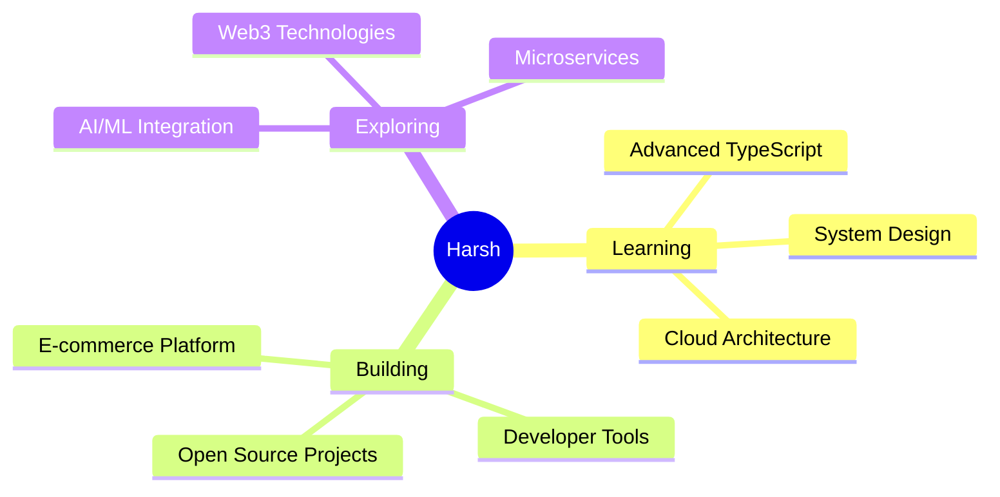

<div align="center">

<!-- Animated Header -->


<!-- Typing Animation -->

<a href="https://git.io/typing-svg"></a>

<p align="center">
  
  
</p>

</div>

---

## 👨‍💻 About Me

```typescript
const harsh = {
  location: "India 🇮🇳",
  role: "Software Developer",
  code: ["JavaScript", "TypeScript", "Python", "C#"],
  technologies: {
    frontEnd: {
      frameworks: ["React", "Next.js", "Vue"],
      styling: ["CSS3", "Tailwind", "Styled-Components"],
      stateManagement: ["Redux", "Zustand", "Context API"],
    },
    backEnd: {
      runtime: ["Node.js", "Express"],
      databases: ["MongoDB", "PostgreSQL", "Redis"],
    },
    devOps: ["Docker", "Git", "GitHub Actions"],
    tools: ["VS Code", "Postman", "Figma"],
  },
  currentFocus: "Building scalable web applications",
  funFact: "I debug with console.log() and I'm not ashamed! 😄",
};
```

<div align="center">

### 🎯 What I Do

</div>

<table align="center">
<tr>
<td align="center" width="33%">

<h4>Clean Code</h4>
<p>Writing maintainable, scalable, and efficient code</p>
</td>
<td align="center" width="33%">

<h4>Web Development</h4>
<p>Creating responsive and interactive web experiences</p>
</td>
<td align="center" width="33%">

<h4>API Design</h4>
<p>Building robust RESTful and GraphQL APIs</p>
</td>
</tr>
</table>

---

## 🛠️ Tech Stack

<div align="center">

### Languages


### Frameworks & Libraries


### Databases & Tools


</div>

---

## 📊 GitHub Statistics

<div align="center">
  
  
</div>

<div align="center">
  
  
</div>

---

## 🏆 GitHub Trophies

<div align="center">
  
</div>

---

## 📈 Contribution Graph

<div align="center">
  
</div>

---

## 🎯 Current Focus

<div align="center">



</div>

---

## 💼 Featured Projects

<div align="center">

<a href="https://github.com/hprakash1999/clearvue">
  
</a>

<!-- Add more featured projects here -->

</div>

---

## 🌐 Connect With Me

<div align="center">

[](https://linkedin.com/in/harsh-prakash)
[](https://twitter.com/hprakash1999)
[](mailto:harsh.prakash@gmail.com)
[](https://hprakash.dev)
[](https://github.com/hprakash1999)
[](https://discord.gg/yourdiscord)

</div>

---

## 💡 Random Dev Quote

<div align="center">


</div>

---

## 🐍 Contribution Snake

<div align="center">
  
</div>

---

<div align="center">

### 💭 Quote of the Day

_"Code is like humor. When you have to explain it, it's bad."_ – Cory House

---

### ⚡ Fun Fact


---

### 📫 Let's Build Something Amazing Together!


</div>
